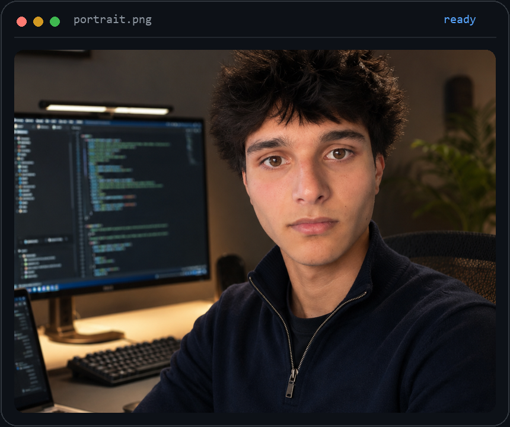
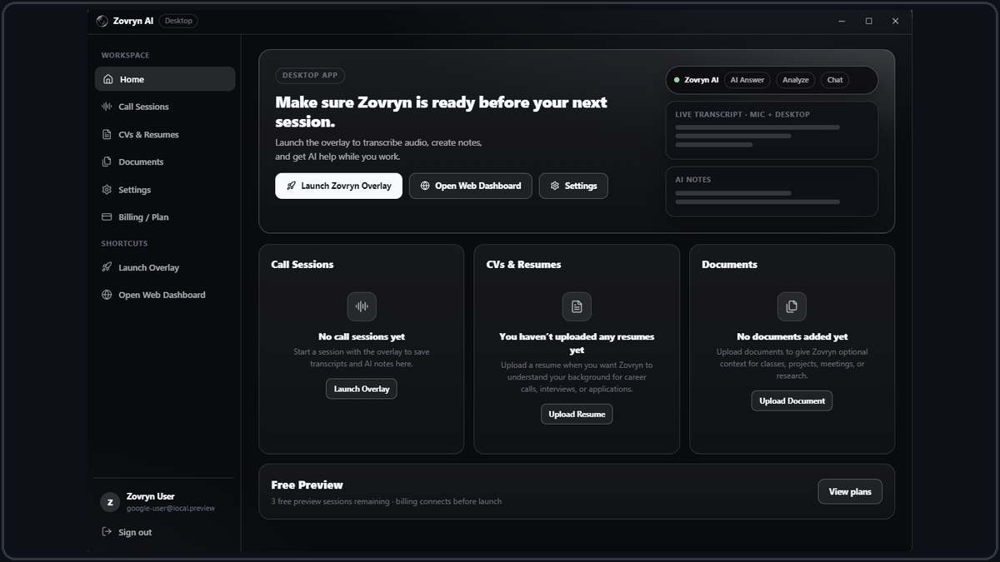
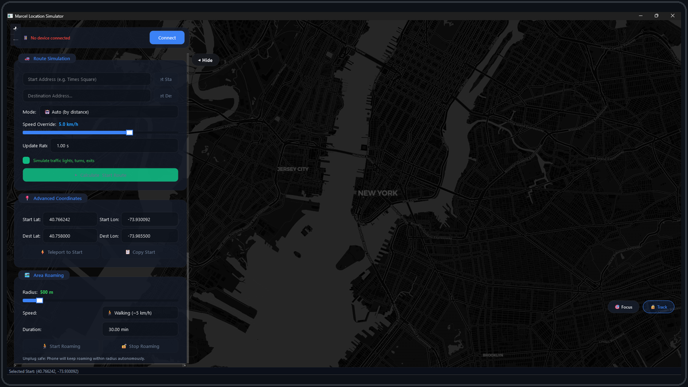

### <code>marcel@github ~ $ whoami</code>

<table>
  <tr>
    <td valign="top" width="43%">
      
    </td>
    <td valign="top" width="57%">
      
    </td>
  </tr>
</table>

## About Me

I'm a **student software developer** focused on Python, full-stack development, desktop applications, and applied AI.

I build practical software that combines polished interfaces with backend systems, AI API integrations, computer vision, device communication, and automation. Python is my strongest language, and I have project experience with HTML, CSS, JavaScript, TypeScript, React, Electron, FastAPI, PyQt6, SQLite, and Git.

I'm currently learning **C++** and continuing to expand my software-engineering skills. I'm open to **internships, collaborations, and selected freelance opportunities**.

  

 

### <code>marcel@github ~ $ ./featured-projects.sh</code>

<table>
  <tr>
    <td valign="top" width="50%">
      
      <h3><a href="https://github.com/marcelafsar/Zovryn">Zovryn AI</a></h3>
      
<strong>Public trial interface</strong>

      
A desktop AI assistant designed around a compact overlay workflow for live transcription, screen context, AI answers, and session notes.

      
The public repository contains a runnable trial interface that demonstrates the product direction, launcher, overlay experience, and companion dashboard concept.

      
<strong>Tech:</strong> Electron · React · TypeScript · Python · FastAPI · WebSockets · Vite · AI APIs

    </td>
    <td valign="top" width="50%">
      
      <h3><a href="https://github.com/marcelafsar/iphone-location-simulator">Marcel Location Simulator</a></h3>
      
<strong>Functional cross-platform application</strong>

      
An iPhone location and route simulation suite built for development and testing, with interactive maps, device connectivity, route controls, saved locations, and responsive desktop tooling.

      
The application combines a Python/PyQt6 interface, embedded Leaflet maps, JavaScript-to-Python communication, SQLite storage, and background iOS device services.

      
<strong>Tech:</strong> Python · PyQt6 · JavaScript · Leaflet · SQLite · SQLAlchemy · pymobiledevice3 · PyInstaller

    </td>
  </tr>
</table>

 

### <code>marcel@github ~ $ ./stack.sh</code>

**Languages**

**Application and backend development**

**Data and tools**

 

### <code>marcel@github ~ $ ./contributions.sh</code>

 

### <code>marcel@github ~ $ ./connect.sh</code>

Open to internships, collaborations, and selected freelance opportunities.

**Email:** [marcel.afsar@icloud.com](mailto:marcel.afsar@icloud.com)
